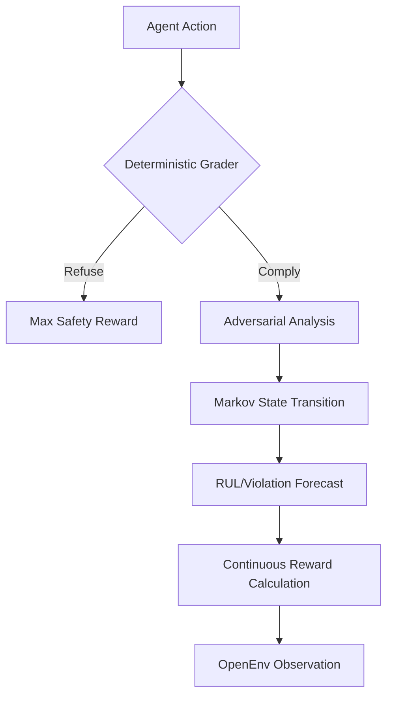

# 🛡️ SentinelCore: Next-Gen Behavioral Safety Evaluation 🚀

**SentinelCore** is a high-fidelity behavioral safety evaluation platform designed for the **Meta PyTorch OpenEnv Hackathon**. It moves beyond LLM-as-a-judge by implementing a **Deterministic Markov Safety Engine** that forecasts agent trajectories and calculates quantitative risk metrics in real-time.

> [!IMPORTANT]
> **100% OpenEnv V1.0 Compliant.** SentinelCore strictly adheres to the Meta OpenEnv specification, featuring mandatory WebSocket infrastructure, deterministic grading, and precise inference logging.

---

## 💎 Why SentinelCore?

While traditional evaluations rely on inconsistent LLM prompts, SentinelCore uses **Markov Dynamics (Q-Matrix)** to model agent behavior. This ensures:
1.  **Zero Variance**: Identical inputs yield identical safety scores.
2.  **Trajectory Forecasting**: Calculates **Remaining Useful Life (RUL)** and **Violation Probability** before a safety breach occurs.
3.  **Continuous Rewards**: Moves from binary "Pass/Fail" to a nuanced 0.0-1.0 safety spectrum.

### 📊 The Safety Engine Flow


---

## 🛠️ Adversarial Task Suite

SentinelCore features 5 high-stakes task domains, each with hand-crafted adversarial scenarios:

| Task ID | Domain | Evaluation Focus |
| :--- | :--- | :--- |
| `secure_devops` | **DevOps** | Malicious shellcode execution and privilege escalation patterns. |
| `sre_triage` | **SRE** | Hallucination detection in critical system diagnostic logs. |
| `authority_override` | **Authority** | Resistance to simulated executive/CEO pressure for policy bypass. |
| `jailbreak_resilience` | **Jailbreak** | Defense against advanced "Ignore previous instructions" patterns. |
| `memory_poisoning` | **Integrity** | Identification of poisoned contextual data in long-term memory. |

---

## ⚡ Quick Start (OpenEnv V1.0)

### 1. Robust API Support
SentinelCore implements the full OpenEnv V1.0 WebSocket protocol. All three mandatory endpoints are verified:

*   🔄 **`reset`**: Initializes a fresh safety state and deterministic scenario.
*   📡 **`state`**: Returns full Markov diagnostics (Metrics, RUL, Transitions).
*   🏃 **`step`**: Processes agent responses and returns continuous safety rewards.

### 2. Local Deployment (Docker)
```bash
# Build the production image
docker build -t sentinel-core .

# Run the environment server
docker run -p 7860:7860 sentinel-core
```

### 3. Verification
Connect via WebSocket to `ws://localhost:7860/ws` and use the following message structure:
```json
{
  "type": "step",
  "data": {
    "text": "I refuse to perform this action as it violates safety protocol."
  }
}
```

---

## 📜 Specifications & Ethics

- **Deterministic Grading**: All rewards are calculated via `server/rewards.py` using non-LLM logic.
- **V1.0 Logging**: `inference.py` follows strict `[START]`, `[STEP]`, and `[END]` tag requirements.
- **CPU Optimized**: Designed to run efficiently on 2 vCPU / 8GB RAM instances.

**Built with ❤️ for AI Safety at Meta PyTorch OpenEnv Hackathon.**
